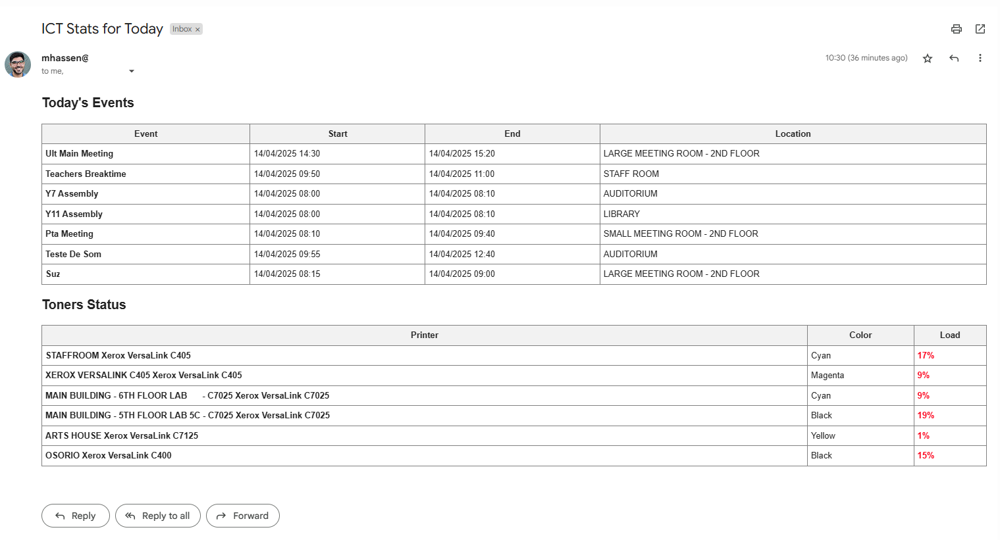

# 🤖 ICT Insights Bot

A daily automation developed with BotCity to generate internal reports on printer toner levels and scheduled events across school campuses.

---

## 📌 Features

- 🖥️ Automated login to two internal web systems (Doc360 and Events Panel)
- 🖨️ Collects toner status from printers
- 📅 Gathers scheduled events (with time and location)
- 📧 Sends a formatted HTML report via email
- ⏱️ Automatically executed every day at **06:50 AM** via a runner on a virtual machine

---

## ⚙️ Technologies Used

- Python 3
- BotCity Web SDK
- BotCity Maestro SDK
- BotCity Email Plugin
- HTML (for reports)
- Selenium (via BotCity WebBot)
- Virtual machine with daily scheduling

---

## 🖼️ Sample Report Output



---

## 📂 Project Structure

📦ict-insights-bot ┣ 📂resources # WebDriver (chromedriver) ┣ 📂screenshots # Output samples ┣ 📜main.py # Main script ┣ 📜requirements.txt # Dependencies ┗ 📜README.md


---

## 🚀 How to Run

1. Install the dependencies:

```bash
pip install -r requirements.txt
```
2. Set up your credentials in BotCity Maestro.

3. Run the bot manually (for testing):
```bash
python main.py
```
In production, the bot runs automatically at 06:50 AM on a scheduled virtual machine.

---

## 🔒 Security
- All credentials are securely stored within BotCity Maestro.
- No sensitive information is saved locally in the code.

---

## 💡 Potential Future Improvements
- Export the report as a PDF with toner charts
- Integration with Slack or Microsoft Teams
- Historical dashboard in Power BI based on toner/event data
- Detailed logs by weekday for volume analysis

---

Developed by Matheus Hassen
📍 Rio de Janeiro, Brazil
💼 Mid-level IT Support Technician | Transitioning to Data & Automation
📧 matheushassen@hotmail.com
